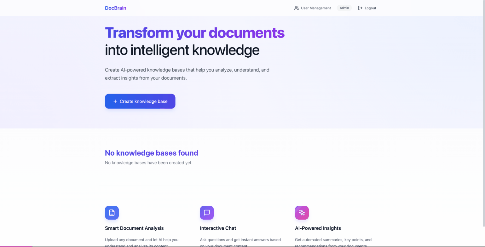

# DocBrain

Self-hosted RAG for teams that can't send data to third-party APIs. Built-in RBAC, multi-LLM support, and natural language queries over your tabular data.




## Quickstart

```bash
git clone https://github.com/shivama205/DocBrain.git && cd DocBrain
cp .env.example .env   # add your LLM API key (Gemini, OpenAI, or Anthropic)
docker compose up -d
# Open http://localhost:3000
```

That's it. The stack includes the API server, Celery worker, MySQL, Redis, ChromaDB (local vector store), and the React frontend. The only thing you need to provide is an LLM API key.

## Why DocBrain?

- **Actually self-hosted** -- vectors stay local (ChromaDB), no data leaves your infra
- **Table-Augmented Generation** -- ask natural language questions over CSVs, get SQL-generated answers
- **No framework lock-in** -- zero LangChain/LlamaIndex dependencies
- **Built-in RBAC** -- three role levels + knowledge base sharing with granular permissions
- **Multi-LLM** -- swap between Gemini, OpenAI, Anthropic via config

## Key Features

| Feature | Description |
|---------|-------------|
| **Document RAG** | Upload PDFs, DOCX, TXT, Markdown, HTML -- ask questions, get cited answers |
| **Table-Augmented Generation** | Upload CSVs/Excel -- ask questions in plain English, get SQL-generated results |
| **Local Vector Store** | ChromaDB runs locally by default. Pinecone available for production scale |
| **Multi-LLM Support** | Google Gemini, OpenAI, Anthropic -- switch with one env var |
| **Query Router** | Automatically routes queries to RAG or TAG based on content type |
| **RBAC** | Admin, Owner, User roles with granular permissions |
| **Knowledge Base Sharing** | Share knowledge bases with specific users |
| **FAQ System** | Add curated Q&A pairs that take priority over document search |

## Manual Setup (without Docker)

If you prefer running without Docker:

```bash
# Install dependencies
pip install -r requirements.txt

# Configure environment
cp .env.example .env
# Edit .env: add LLM API key, set database credentials

# Terminal 1: Start API server
uvicorn app.main:app --host 0.0.0.0 --port 8000 --reload

# Terminal 2: Start Celery worker
celery -A app.worker.celery worker --loglevel=info
```

You'll also need MySQL and Redis running. See `.env.example` for all configuration options.

The frontend is in a separate repo: [DocBrain-UI](https://github.com/shivama205/DocBrain-UI).

## Vector Store Options

| Store | Use Case | Config |
|-------|----------|--------|
| **ChromaDB** (default) | Development, self-hosted production. Zero config, runs locally | `VECTOR_STORE_TYPE=chroma` |
| **Pinecone** | Large-scale production with managed infrastructure | `VECTOR_STORE_TYPE=pinecone` + API key |

## Advanced Features

### Query Router

The Query Router intelligently analyzes incoming queries and routes them to the most appropriate service for processing:

- **Advanced Question Processing**: Supports complex, multi-part questions with automatic decomposition and contextual awareness
- **Intelligent Classification**: Categorizes queries as factual, analytical, or hypothetical for optimized processing
- **Query Type Detection**: Automatically identifies queries about statistical information, database content, or tabular data
- **Confidence Scoring**: Provides confidence scores with each routing decision for transparent retrieval logic
- **Specialized Use Cases**: Optimized handling for FAQs, feature requirements, technical documentation, and other enterprise needs
- **Follow-up Handling**: Maintains context for conversational queries and follow-up questions
- **Clarification Mechanisms**: Identifies ambiguous queries and requests clarification when needed
- **Fallback Strategy**: Defaults to the most appropriate retrieval method for unclear queries, ensuring consistent responses

### Table Augmented Generation (TAG)

TAG enhances DocBrain's ability to reason over tabular data:

- **SQL Generation**: Automatically converts natural language queries into SQL
- **Table Schema Analysis**: Maintains and analyzes the structure of ingested tables
- **CSV Support**: Specialized ingestors for tabular data formats
- **Query Execution**: Runs generated SQL against stored tables and formats results
- **Explanation Generation**: Provides natural language explanations of results alongside the data

### Role-Based Access Control (RBAC)

DocBrain implements a comprehensive permission system to secure your data:

- **User Roles**: Three predefined roles with escalating privileges:
  - **User**: Basic access to shared knowledge bases and conversation capabilities
  - **Owner**: Can create, manage, and share their own knowledge bases
  - **Admin**: Full system access with user management capabilities
  
- **Permission System**: Granular permissions control access to specific features:
  - Knowledge base management (view, create, update, delete)
  - Document operations (view, upload, delete)
  - User management (view, create, update, delete)
  - System administration

- **Knowledge Base Sharing**: Secure sharing mechanism allows:
  - Owners to share knowledge bases with specific users
  - Users to access only knowledge bases explicitly shared with them
  - Dedicated API endpoint for users to view knowledge bases shared with them

## Release Notes

For detailed information about the latest features and improvements, please see our [RELEASE_NOTES.md](RELEASE_NOTES.md) file.

## Roadmap

DocBrain has an ambitious development roadmap focused on enhancing capabilities while maintaining our commitment to privacy and security.

We've recently completed implementation of:
- ✅ **Table Augmented Generation (TAG)** - SQL-based tabular data querying
- ✅ **Enhanced Query Router** - Intelligent routing with advanced question handling for FAQs and specialized use cases
- ✅ **Multiple LLM Provider Support** - Factory pattern for integrating various LLM providers
- ✅ **Role-Based Access Control** - Comprehensive permission system
- ✅ **Knowledge Base Sharing** - Secure sharing between users

Some planned future features include:
- ✅ **Multiple Vector Database Support** - ChromaDB (local) + Pinecone (cloud)
- **RAG Evaluation Framework** - Integration with RAGAS for measuring performance
- **Document-Level Permissions** - Fine-grained access control at the document level
- **API Rate Limiting** - Prevent abuse and ensure fair resource allocation
- **Advanced Analytics** - Usage statistics and performance metrics

For the full development roadmap with implementation details and planned features, see our [ROADMAP.md](ROADMAP.md) file.

## Contributing

**We Need Your Help!** DocBrain is built by developers who understand enterprise security needs.

If you:
- Work with sensitive internal documents
- Need a RAG solution free from third-party dependencies
- Have experience building secure enterprise applications
- Want to shape the future of private, self-hosted AI

...then we'd love your contributions!

Here's how to get involved:

1. Fork the repository
2. Create your feature branch (`git checkout -b feature/amazing-feature`)
3. Commit your changes (`git commit -m 'Add some amazing feature'`)
4. Push to the branch (`git push origin feature/amazing-feature`)
5. Open a Pull Request

Areas where contributions are especially welcome:
- Document processors for specialized formats
- Vector database connectors
- Security and compliance enhancements
- Performance optimizations
- Documentation and examples

## License

This project is licensed under the MIT License - see the [LICENSE](LICENSE) file for details.
